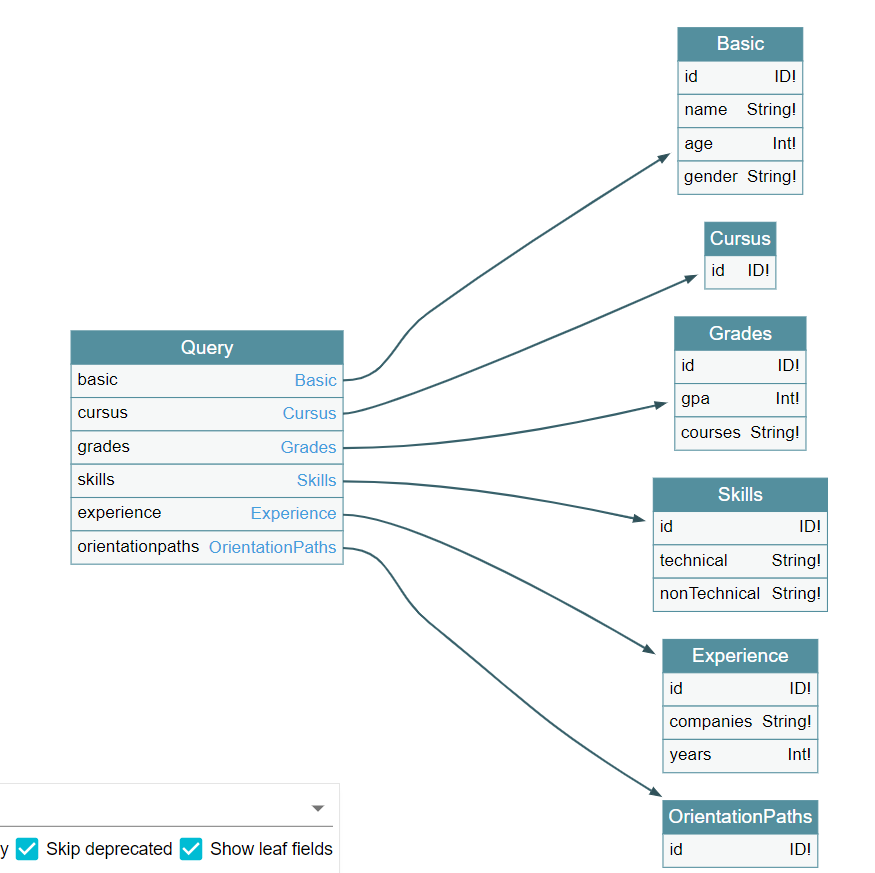

# Digital-Dynamic_CV

### Project Overview
Repository that tracks the development of the Digital Dynamic CV project as a GraphQL data model. The project is utilized in ongoing work and collaboration with the a New Governance initiative, Stanford University and many institutions.

### Version Summary
This is the first version of the Digital Dynamic CV. Enhancements will be made as the requirements of the project and clarity on the data sources evolve.

### Schema

### File Descriptions
- DynamicCV_Schema.png - GraphQL schema in png format
- dynamic_cv_sdl.json - json file containing GraphQL schema
